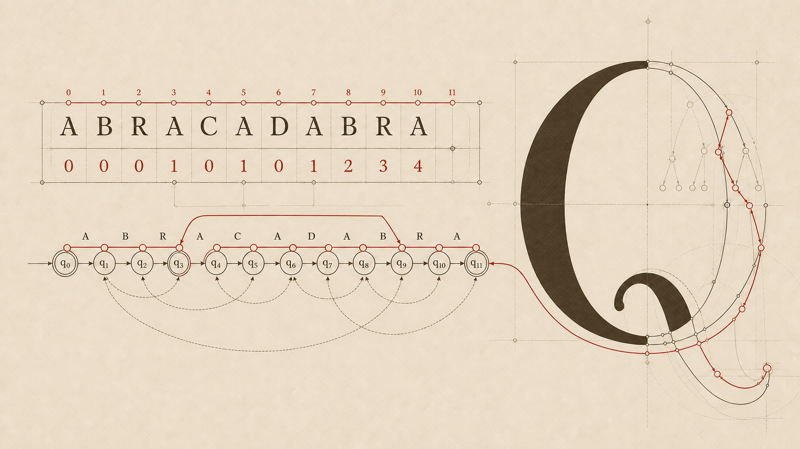
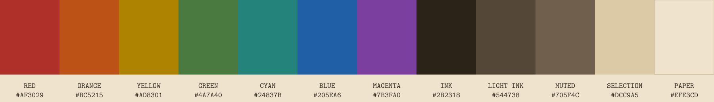
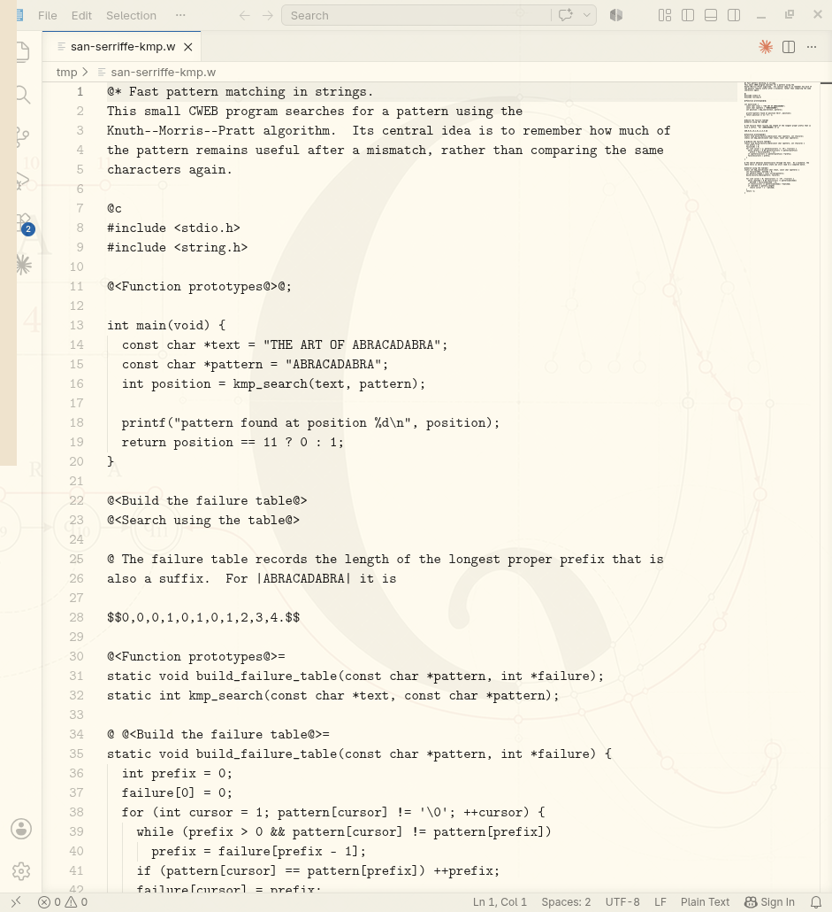
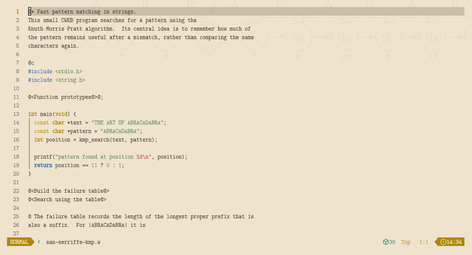

# San Serriffe for Omarchy

An academic, warm-light theme for [Omarchy](https://omarchy.org), inspired by Donald Knuth's work in algorithms, typography, and literate programming.

The wallpaper brings together the failure function of Knuth–Morris–Pratt over `ABRACADABRA` and an original constructed **Q** inspired by METAFONT's visual language and glyph-design process. It is not a reproduction of a METAFONT or Computer Modern glyph. The palette uses cream paper, dark ink, and restrained editorial red.

## Wallpaper



## Color palette



## Editors

San Serriffe is rendered in editors through Omarchy Quattro's native templates. Both screenshots show the same working [CWEB implementation of KMP](examples/kmp.w), successfully processed with CTANGLE and CWEAVE.

### VS Code



### LazyVim



## Install

```sh
omarchy theme install https://github.com/VictorBitancourt/omarchy-san-serriffe-theme
```

San Serriffe is designed to pair with **Latin Modern Mono**, the modernized and extended descendant of Knuth's Computer Modern typeface. Install the TeX Live font package, expose its OpenType files to Fontconfig, and select it through Omarchy:

```sh
sudo pacman -S texlive-fontsrecommended
mkdir -p ~/.local/share/fonts/latin-modern
find /usr/share/texmf-dist/fonts/opentype/public/lm -maxdepth 1 -type f -name '*.otf' \
  -exec ln -sf {} ~/.local/share/fonts/latin-modern/ \;
fc-cache -f
omarchy font set "Latin Modern Mono"
```

The font is recommended, but not required to use the theme. Omarchy applies the theme's colors to supported applications using its native Quattro templates.

## Palette

- Paper: `#EFE3CD`
- Ink: `#2B2318`
- Editorial red: `#AF3029`
- Muted ink: `#705F4C`

## References

- Donald E. Knuth, James H. Morris Jr., and Vaughan R. Pratt, “Fast Pattern Matching in Strings” (1977)
- Donald E. Knuth, *The Art of Computer Programming*
- Donald E. Knuth, *The METAFONTbook*
- Latin Modern by the GUST e-foundry

## License

MIT. See [LICENSE](LICENSE).
